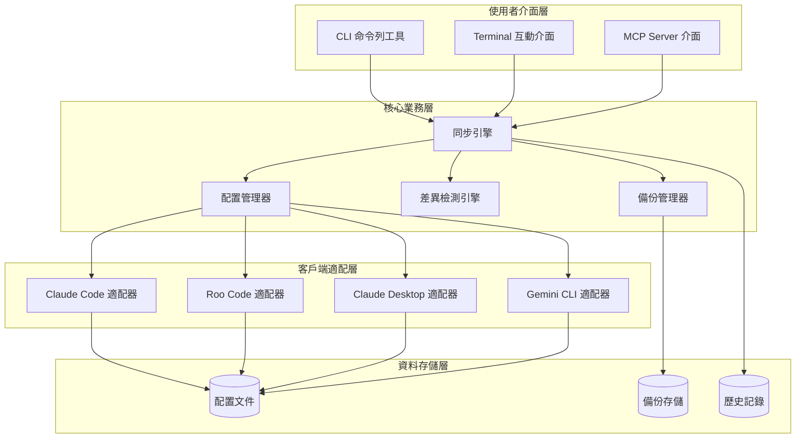

# SyncMCP 改進 - 系統設計文件

> 本文件由 Vibe Coding 工作流程自動產生，基於 `rfp/requirements.md` 的需求和驗收標準

## 📋 概述

### 系統目標
將 SyncMCP 從一個簡單的 Python 腳本工具，升級為功能完整、用戶友善的 MCP 配置管理系統，包含：
1. 全局 CLI 工具（可在任何位置執行）
2. 互動式 Terminal 介面
3. MCP Server 整合（LLM 可調用）
4. 完善的錯誤處理和備份機制

### 核心價值主張
- **易用性**：一鍵安裝，全局可用，互動式介面
- **可靠性**：自動備份，差異檢測，安全回滾
- **可見性**：清晰的狀態顯示，配置路徑查看，歷史記錄
- **智能化**：LLM 整合，自然語言操作，衝突自動解決

---

## 🏗 架構設計

### 整體架構圖



### 分層架構

#### 1. 使用者介面層
- **CLI 工具**：傳統命令列介面，支援所有功能
- **TUI (Terminal UI)**：互動式選單介面，適合非技術用戶
- **MCP Server**：提供標準 MCP 工具，供 LLM 調用

#### 2. 核心業務層
- **同步引擎**：協調所有同步操作的核心邏輯
- **配置管理器**：管理各客戶端配置的讀寫
- **差異檢測引擎**：分析配置差異並生成報告
- **備份管理器**：自動備份和恢復配置

#### 3. 客戶端適配層
- 為每個 MCP 客戶端提供專用適配器
- 處理格式差異和路徑解析
- 驗證配置的有效性

#### 4. 資料存儲層
- 配置文件的實際存儲位置
- 備份文件的管理
- 同步歷史記錄的持久化

---

## 🧩 元件和介面設計

### 1. CLI 命令列工具

```python
# syncmcp/cli.py
from typing import Optional
import click
from rich.console import Console

@click.group()
@click.version_option()
def cli():
    """SyncMCP - MCP 配置同步工具"""
    pass

@cli.command()
@click.option('--auto', is_flag=True, help='自動選擇最新配置')
@click.option('--dry-run', is_flag=True, help='預覽變更但不執行')
@click.option('--backup/--no-backup', default=True, help='是否備份')
def sync(auto: bool, dry_run: bool, backup: bool):
    """執行 MCP 配置同步"""
    pass

@cli.command()
@click.option('--format', type=click.Choice(['table', 'json']), default='table')
def status(format: str):
    """顯示所有客戶端的配置狀態"""
    pass

@cli.command()
@click.argument('client', required=False)
def list(client: Optional[str]):
    """列出配置文件路徑和 MCP 列表"""
    pass

@cli.command()
@click.argument('client', type=click.Choice(['claude-code', 'roo-code', 'claude-desktop', 'gemini']))
def open(client: str):
    """在編輯器中打開配置文件"""
    pass

@cli.command()
def diff():
    """顯示同步前後的差異"""
    pass

@cli.command()
@click.argument('backup_id')
def restore(backup_id: str):
    """從備份恢復配置"""
    pass

@cli.command()
@click.option('--limit', default=10, help='顯示記錄數量')
def history(limit: int):
    """查看同步歷史記錄"""
    pass

@cli.command()
def interactive():
    """啟動互動式介面（TUI）"""
    pass
```

### 2. 同步引擎

```python
# syncmcp/core/sync_engine.py
from dataclasses import dataclass
from typing import Dict, List, Optional
from enum import Enum

class SyncStrategy(Enum):
    AUTO = "auto"  # 自動選擇最新
    MANUAL = "manual"  # 手動選擇來源
    MERGE = "merge"  # 合併所有配置

@dataclass
class SyncResult:
    success: bool
    changes: Dict[str, List[str]]  # client -> [changes]
    warnings: List[str]
    errors: List[str]
    backup_path: Optional[str]

class SyncEngine:
    """核心同步引擎"""

    def __init__(self, config_manager, diff_engine, backup_manager):
        self.config_manager = config_manager
        self.diff_engine = diff_engine
        self.backup_manager = backup_manager

    async def sync(
        self,
        strategy: SyncStrategy = SyncStrategy.AUTO,
        dry_run: bool = False,
        create_backup: bool = True
    ) -> SyncResult:
        """執行同步操作"""
        # 1. 載入所有客戶端配置
        configs = await self.config_manager.load_all()

        # 2. 分析差異
        diff_report = await self.diff_engine.analyze(configs)

        # 3. 檢測警告（配置丟失等）
        warnings = self._detect_warnings(diff_report)

        # 4. 如果是 dry-run，返回預覽
        if dry_run:
            return SyncResult(
                success=True,
                changes=diff_report.changes,
                warnings=warnings,
                errors=[],
                backup_path=None
            )

        # 5. 創建備份
        backup_path = None
        if create_backup:
            backup_path = await self.backup_manager.create_backup(configs)

        # 6. 執行同步
        try:
            await self._execute_sync(configs, strategy)
            return SyncResult(
                success=True,
                changes=diff_report.changes,
                warnings=warnings,
                errors=[],
                backup_path=backup_path
            )
        except Exception as e:
            # 7. 失敗時恢復
            if backup_path:
                await self.backup_manager.restore(backup_path)
            return SyncResult(
                success=False,
                changes={},
                warnings=warnings,
                errors=[str(e)],
                backup_path=backup_path
            )

    def _detect_warnings(self, diff_report) -> List[str]:
        """檢測潛在問題"""
        warnings = []
        for client, changes in diff_report.items():
            if changes.get('removed'):
                warnings.append(
                    f"警告: {client} 將失去 {len(changes['removed'])} 個 MCP 配置"
                )
        return warnings

    async def _execute_sync(self, configs, strategy):
        """執行實際的同步操作"""
        if strategy == SyncStrategy.AUTO:
            # 選擇最新配置作為源
            source = self._select_newest(configs)
        elif strategy == SyncStrategy.MERGE:
            # 合併所有配置
            source = self._merge_configs(configs)
        else:
            raise ValueError(f"不支援的策略: {strategy}")

        # 寫入所有客戶端
        await self.config_manager.sync_all(source)
```

### 3. 配置管理器

```python
# syncmcp/core/config_manager.py
from abc import ABC, abstractmethod
from pathlib import Path
from typing import Dict, List, Optional
import json

class ClientConfig:
    """客戶端配置的統一表示"""

    def __init__(self, client_name: str, file_path: Path):
        self.client_name = client_name
        self.file_path = file_path
        self.mcpServers: Dict = {}
        self.last_modified: Optional[float] = None

    def load(self):
        """載入配置文件"""
        if not self.file_path.exists():
            return

        with open(self.file_path) as f:
            data = json.load(f)
            self.mcpServers = data.get('mcpServers', {})
            self.last_modified = self.file_path.stat().st_mtime

    def save(self):
        """保存配置文件"""
        # 確保目錄存在
        self.file_path.parent.mkdir(parents=True, exist_ok=True)

        # 保持原有結構，只更新 mcpServers
        if self.file_path.exists():
            with open(self.file_path) as f:
                data = json.load(f)
        else:
            data = {}

        data['mcpServers'] = self.mcpServers

        with open(self.file_path, 'w') as f:
            json.dump(data, f, indent=2)

class ClientAdapter(ABC):
    """客戶端適配器基類"""

    @abstractmethod
    def get_config_path(self) -> Path:
        """獲取配置文件路徑"""
        pass

    @abstractmethod
    def normalize_config(self, config: Dict) -> Dict:
        """標準化配置格式"""
        pass

    @abstractmethod
    def validate_config(self, config: Dict) -> List[str]:
        """驗證配置有效性，返回錯誤列表"""
        pass

class ClaudeCodeAdapter(ClientAdapter):
    def get_config_path(self) -> Path:
        return Path.home() / '.claude.json'

    def normalize_config(self, config: Dict) -> Dict:
        # Claude Code 配置已是標準格式
        return config

    def validate_config(self, config: Dict) -> List[str]:
        errors = []
        # 驗證必要欄位
        for name, server in config.get('mcpServers', {}).items():
            if 'command' not in server:
                errors.append(f"{name}: 缺少 'command' 欄位")
        return errors

class RooCodeAdapter(ClientAdapter):
    def get_config_path(self) -> Path:
        return Path.home() / 'Library/Application Support/Code/User/globalStorage/rooveterinaryinc.roo-cline/settings/mcp_settings.json'

    def normalize_config(self, config: Dict) -> Dict:
        # Roo Code 可能有不同的格式，需要轉換
        return config

    def validate_config(self, config: Dict) -> List[str]:
        return []

class ClaudeDesktopAdapter(ClientAdapter):
    def get_config_path(self) -> Path:
        return Path.home() / 'Library/Application Support/Claude/claude_desktop_config.json'

    def normalize_config(self, config: Dict) -> Dict:
        return config

    def validate_config(self, config: Dict) -> List[str]:
        errors = []
        # Claude Desktop 不支援 HTTP MCP
        for name, server in config.get('mcpServers', {}).items():
            if server.get('transport') == 'http':
                errors.append(f"{name}: Claude Desktop 不支援 HTTP transport")
        return errors

class GeminiAdapter(ClientAdapter):
    def get_config_path(self) -> Path:
        return Path.home() / '.gemini/settings.json'

    def normalize_config(self, config: Dict) -> Dict:
        # Gemini 格式轉換
        return config

    def validate_config(self, config: Dict) -> List[str]:
        return []

class ConfigManager:
    """配置管理器 - 管理所有客戶端的配置"""

    def __init__(self):
        self.adapters = {
            'claude-code': ClaudeCodeAdapter(),
            'roo-code': RooCodeAdapter(),
            'claude-desktop': ClaudeDesktopAdapter(),
            'gemini': GeminiAdapter(),
        }

    async def load_all(self) -> Dict[str, ClientConfig]:
        """載入所有客戶端配置"""
        configs = {}
        for name, adapter in self.adapters.items():
            config = ClientConfig(name, adapter.get_config_path())
            config.load()
            configs[name] = config
        return configs

    async def sync_all(self, source_config: ClientConfig):
        """將源配置同步到所有客戶端"""
        for name, adapter in self.adapters.items():
            target_config = ClientConfig(name, adapter.get_config_path())

            # 標準化和驗證
            normalized = adapter.normalize_config(source_config.mcpServers)
            errors = adapter.validate_config({'mcpServers': normalized})

            if errors:
                # 記錄警告但繼續
                print(f"警告: {name} 配置驗證失敗: {errors}")

            # 寫入配置
            target_config.mcpServers = normalized
            target_config.save()
```

### 4. 差異檢測引擎

```python
# syncmcp/core/diff_engine.py
from typing import Dict, List, Set
from dataclasses import dataclass

@dataclass
class DiffItem:
    name: str
    status: str  # 'added', 'removed', 'modified', 'unchanged'
    old_value: Dict = None
    new_value: Dict = None

class DiffReport:
    """差異報告"""

    def __init__(self):
        self.diffs: Dict[str, List[DiffItem]] = {}

    def add_diff(self, client: str, diff_item: DiffItem):
        if client not in self.diffs:
            self.diffs[client] = []
        self.diffs[client].append(diff_item)

    def to_text(self) -> str:
        """轉換為文字報告"""
        lines = []
        for client, items in self.diffs.items():
            lines.append(f"\n{client}:")
            for item in items:
                if item.status == 'added':
                    lines.append(f"  + {item.name}")
                elif item.status == 'removed':
                    lines.append(f"  - {item.name}")
                elif item.status == 'modified':
                    lines.append(f"  ~ {item.name}")
        return "\n".join(lines)

class DiffEngine:
    """差異檢測引擎"""

    async def analyze(self, configs: Dict[str, 'ClientConfig']) -> DiffReport:
        """分析配置差異"""
        report = DiffReport()

        # 找出所有 MCP 的聯集
        all_mcps = self._get_all_mcp_names(configs)

        # 確定「源」配置（最新的）
        source = self._select_source(configs)

        # 對每個客戶端分析差異
        for client_name, config in configs.items():
            if client_name == source.client_name:
                continue  # 跳過源本身

            self._compare_configs(
                source.mcpServers,
                config.mcpServers,
                client_name,
                report
            )

        return report

    def _get_all_mcp_names(self, configs: Dict) -> Set[str]:
        """獲取所有 MCP 名稱"""
        all_names = set()
        for config in configs.values():
            all_names.update(config.mcpServers.keys())
        return all_names

    def _select_source(self, configs: Dict) -> 'ClientConfig':
        """選擇最新的配置作為源"""
        latest = None
        for config in configs.values():
            if config.last_modified:
                if not latest or config.last_modified > latest.last_modified:
                    latest = config
        return latest or next(iter(configs.values()))

    def _compare_configs(self, source: Dict, target: Dict, client: str, report: DiffReport):
        """比較兩個配置"""
        source_keys = set(source.keys())
        target_keys = set(target.keys())

        # 新增的
        for name in source_keys - target_keys:
            report.add_diff(client, DiffItem(
                name=name,
                status='added',
                new_value=source[name]
            ))

        # 移除的
        for name in target_keys - source_keys:
            report.add_diff(client, DiffItem(
                name=name,
                status='removed',
                old_value=target[name]
            ))

        # 修改的
        for name in source_keys & target_keys:
            if source[name] != target[name]:
                report.add_diff(client, DiffItem(
                    name=name,
                    status='modified',
                    old_value=target[name],
                    new_value=source[name]
                ))
```

### 5. 備份管理器

```python
# syncmcp/core/backup_manager.py
from pathlib import Path
from datetime import datetime
import json
import shutil
from typing import Dict, List

class BackupManager:
    """備份管理器"""

    def __init__(self, backup_dir: Path = None):
        self.backup_dir = backup_dir or Path.home() / '.syncmcp/backups'
        self.backup_dir.mkdir(parents=True, exist_ok=True)

    async def create_backup(self, configs: Dict[str, 'ClientConfig']) -> str:
        """創建備份"""
        timestamp = datetime.now().strftime('%Y%m%d_%H%M%S')
        backup_id = f"backup_{timestamp}"
        backup_path = self.backup_dir / backup_id
        backup_path.mkdir()

        # 保存所有配置
        for client_name, config in configs.items():
            if config.file_path.exists():
                dest = backup_path / f"{client_name}.json"
                shutil.copy2(config.file_path, dest)

        # 保存 metadata
        metadata = {
            'id': backup_id,
            'timestamp': timestamp,
            'clients': list(configs.keys())
        }
        with open(backup_path / 'metadata.json', 'w') as f:
            json.dump(metadata, f, indent=2)

        return backup_id

    async def restore(self, backup_id: str):
        """從備份恢復"""
        backup_path = self.backup_dir / backup_id
        if not backup_path.exists():
            raise ValueError(f"備份不存在: {backup_id}")

        # 載入 metadata
        with open(backup_path / 'metadata.json') as f:
            metadata = json.load(f)

        # 恢復每個客戶端
        adapters = {
            'claude-code': ClaudeCodeAdapter(),
            'roo-code': RooCodeAdapter(),
            'claude-desktop': ClaudeDesktopAdapter(),
            'gemini': GeminiAdapter(),
        }

        for client_name in metadata['clients']:
            backup_file = backup_path / f"{client_name}.json"
            if backup_file.exists():
                target_path = adapters[client_name].get_config_path()
                shutil.copy2(backup_file, target_path)

    def list_backups(self) -> List[Dict]:
        """列出所有備份"""
        backups = []
        for backup_path in sorted(self.backup_dir.iterdir(), reverse=True):
            if backup_path.is_dir():
                metadata_file = backup_path / 'metadata.json'
                if metadata_file.exists():
                    with open(metadata_file) as f:
                        backups.append(json.load(f))
        return backups

    def cleanup_old_backups(self, keep: int = 10):
        """清理舊備份，保留最近的 N 個"""
        backups = self.list_backups()
        if len(backups) <= keep:
            return

        for backup in backups[keep:]:
            backup_path = self.backup_dir / backup['id']
            shutil.rmtree(backup_path)
```

### 6. Terminal 互動式介面 (TUI)

```python
# syncmcp/tui/interactive.py
from rich.console import Console
from rich.table import Table
from rich.prompt import Prompt, Confirm
from rich.progress import Progress, SpinnerColumn, TextColumn
from InquirerPy import inquirer

class InteractiveUI:
    """互動式使用者介面"""

    def __init__(self, sync_engine):
        self.console = Console()
        self.sync_engine = sync_engine

    def run(self):
        """運行互動式介面"""
        while True:
            choice = self._show_main_menu()

            if choice == 'sync':
                self._interactive_sync()
            elif choice == 'status':
                self._show_status()
            elif choice == 'diff':
                self._show_diff()
            elif choice == 'restore':
                self._interactive_restore()
            elif choice == 'exit':
                break

    def _show_main_menu(self):
        """顯示主選單"""
        return inquirer.select(
            message="請選擇操作:",
            choices=[
                {'name': '🔄 同步 MCP 配置', 'value': 'sync'},
                {'name': '📊 查看狀態', 'value': 'status'},
                {'name': '🔍 查看差異', 'value': 'diff'},
                {'name': '💾 從備份恢復', 'value': 'restore'},
                {'name': '❌ 退出', 'value': 'exit'},
            ],
        ).execute()

    def _interactive_sync(self):
        """互動式同步"""
        # 顯示預覽
        with self.console.status("[bold green]分析配置差異..."):
            result = asyncio.run(
                self.sync_engine.sync(dry_run=True)
            )

        # 顯示差異
        if result.warnings:
            self.console.print("\n[bold yellow]⚠️  警告:")
            for warning in result.warnings:
                self.console.print(f"  {warning}")

        # 確認執行
        if Confirm.ask("\n確定要執行同步嗎?", default=False):
            with Progress(
                SpinnerColumn(),
                TextColumn("[progress.description]{task.description}"),
                console=self.console
            ) as progress:
                task = progress.add_task("正在同步...", total=None)
                result = asyncio.run(self.sync_engine.sync())
                progress.update(task, completed=True)

            if result.success:
                self.console.print("\n[bold green]✅ 同步完成!")
                if result.backup_path:
                    self.console.print(f"備份保存於: {result.backup_path}")
            else:
                self.console.print("\n[bold red]❌ 同步失敗!")
                for error in result.errors:
                    self.console.print(f"  {error}")

    def _show_status(self):
        """顯示狀態表格"""
        configs = asyncio.run(self.sync_engine.config_manager.load_all())

        table = Table(title="MCP 配置狀態")
        table.add_column("客戶端", style="cyan")
        table.add_column("配置路徑", style="white")
        table.add_column("MCP 數量", style="green")
        table.add_column("最後修改", style="yellow")

        for name, config in configs.items():
            table.add_row(
                name,
                str(config.file_path),
                str(len(config.mcpServers)),
                datetime.fromtimestamp(config.last_modified).strftime('%Y-%m-%d %H:%M:%S') if config.last_modified else 'N/A'
            )

        self.console.print(table)
```

### 7. MCP Server 整合

```python
# syncmcp/mcp/server.py
from mcp.server import Server
from mcp.types import Tool, TextContent
import asyncio

class SyncMCPServer:
    """SyncMCP MCP Server"""

    def __init__(self, sync_engine):
        self.sync_engine = sync_engine
        self.server = Server("syncmcp")
        self._register_tools()

    def _register_tools(self):
        """註冊 MCP 工具"""

        @self.server.list_tools()
        async def list_tools():
            return [
                Tool(
                    name="sync_mcp_configs",
                    description="同步所有 MCP 客戶端的配置",
                    inputSchema={
                        "type": "object",
                        "properties": {
                            "auto": {
                                "type": "boolean",
                                "description": "自動選擇最新配置",
                                "default": True
                            },
                            "dry_run": {
                                "type": "boolean",
                                "description": "僅預覽不執行",
                                "default": False
                            }
                        }
                    }
                ),
                Tool(
                    name="check_sync_status",
                    description="檢查 MCP 配置同步狀態",
                    inputSchema={"type": "object", "properties": {}}
                ),
                Tool(
                    name="show_config_diff",
                    description="顯示配置差異",
                    inputSchema={"type": "object", "properties": {}}
                ),
            ]

        @self.server.call_tool()
        async def call_tool(name: str, arguments: dict):
            if name == "sync_mcp_configs":
                result = await self.sync_engine.sync(
                    dry_run=arguments.get('dry_run', False)
                )
                return [TextContent(
                    type="text",
                    text=self._format_sync_result(result)
                )]

            elif name == "check_sync_status":
                configs = await self.sync_engine.config_manager.load_all()
                return [TextContent(
                    type="text",
                    text=self._format_status(configs)
                )]

            elif name == "show_config_diff":
                configs = await self.sync_engine.config_manager.load_all()
                diff = await self.sync_engine.diff_engine.analyze(configs)
                return [TextContent(
                    type="text",
                    text=diff.to_text()
                )]

    def _format_sync_result(self, result) -> str:
        """格式化同步結果"""
        lines = []
        if result.success:
            lines.append("✅ 同步成功!")
        else:
            lines.append("❌ 同步失敗!")

        if result.warnings:
            lines.append("\n警告:")
            lines.extend(f"  - {w}" for w in result.warnings)

        if result.changes:
            lines.append("\n變更:")
            for client, changes in result.changes.items():
                lines.append(f"  {client}: {len(changes)} 項變更")

        return "\n".join(lines)

    def _format_status(self, configs) -> str:
        """格式化狀態資訊"""
        lines = ["MCP 配置狀態:\n"]
        for name, config in configs.items():
            lines.append(f"{name}:")
            lines.append(f"  路徑: {config.file_path}")
            lines.append(f"  MCP 數量: {len(config.mcpServers)}")
            if config.mcpServers:
                lines.append(f"  MCP 列表: {', '.join(config.mcpServers.keys())}")
        return "\n".join(lines)

    async def run(self):
        """運行 MCP Server"""
        from mcp.server.stdio import stdio_server
        async with stdio_server() as (read_stream, write_stream):
            await self.server.run(
                read_stream,
                write_stream,
                self.server.create_initialization_options()
            )
```

---

## 📦 資料模型

### 配置文件結構

```typescript
// 統一的 MCP 配置格式
interface MCPConfig {
  mcpServers: {
    [serverName: string]: MCPServer
  }
}

interface MCPServer {
  command: string
  args?: string[]
  env?: { [key: string]: string }
  transport?: 'stdio' | 'http' | 'sse'
  url?: string  // for HTTP/SSE transport
}

// 備份 metadata
interface BackupMetadata {
  id: string
  timestamp: string
  clients: string[]
}

// 同步歷史記錄
interface SyncHistory {
  id: string
  timestamp: string
  result: 'success' | 'failed'
  changes: {
    [client: string]: {
      added: string[]
      removed: string[]
      modified: string[]
    }
  }
  warnings: string[]
  errors: string[]
}
```

---

## 🛡 錯誤處理策略

### 1. 分層錯誤處理

```python
# 定義錯誤層級
class SyncMCPError(Exception):
    """基礎錯誤類別"""
    pass

class ConfigNotFoundError(SyncMCPError):
    """配置文件不存在"""
    pass

class ConfigValidationError(SyncMCPError):
    """配置驗證失敗"""
    pass

class BackupError(SyncMCPError):
    """備份操作失敗"""
    pass

class SyncError(SyncMCPError):
    """同步操作失敗"""
    pass

# 友善的錯誤訊息映射
ERROR_MESSAGES = {
    ConfigNotFoundError: "找不到配置文件。請確認客戶端已安裝。",
    ConfigValidationError: "配置格式不正確。請檢查 JSON 語法。",
    BackupError: "備份失敗。請確認有足夠的磁碟空間。",
    SyncError: "同步失敗。配置已回滾到備份狀態。",
}
```

### 2. 錯誤恢復機制

- **配置驗證失敗**：跳過該客戶端，繼續其他客戶端
- **備份失敗**：中止同步，不修改任何配置
- **同步失敗**：自動從備份恢復
- **部分失敗**：提供回滾選項

### 3. 日誌記錄

```python
# syncmcp/utils/logger.py
import logging
from pathlib import Path

def setup_logger(verbose: bool = False):
    log_dir = Path.home() / '.syncmcp/logs'
    log_dir.mkdir(parents=True, exist_ok=True)

    level = logging.DEBUG if verbose else logging.INFO

    logging.basicConfig(
        level=level,
        format='%(asctime)s [%(levelname)s] %(message)s',
        handlers=[
            logging.FileHandler(log_dir / 'syncmcp.log'),
            logging.StreamHandler()
        ]
    )
```

---

## 🧪 測試策略

### 1. 單元測試

- 使用 `pytest` 作為測試框架
- 測試覆蓋率目標：>80%
- Mock 文件系統操作以避免實際文件修改

```python
# tests/test_sync_engine.py
import pytest
from syncmcp.core.sync_engine import SyncEngine

@pytest.fixture
def mock_configs():
    # 返回模擬配置
    pass

def test_sync_auto_strategy(mock_configs):
    """測試自動同步策略"""
    engine = SyncEngine(...)
    result = await engine.sync(strategy=SyncStrategy.AUTO)
    assert result.success
```

### 2. 整合測試

- 測試完整的同步流程
- 使用臨時目錄作為測試配置路徑
- 驗證備份和恢復功能

### 3. 端對端測試

- 模擬真實的用戶操作流程
- 測試 CLI 命令的輸出
- 驗證 TUI 互動流程

---

## ⚡ 效能考量

### 1. 非同步操作

- 使用 `asyncio` 處理 I/O 操作
- 並行讀取多個配置文件
- 非阻塞的備份操作

### 2. 快取機制

- 快取配置文件的 MD5 雜湊值
- 避免不必要的文件讀寫
- 記憶最近的差異分析結果

### 3. 批次操作

- 批次寫入多個配置文件
- 減少磁碟 I/O 次數

---

## 🔒 安全性考量

### 1. 文件權限

- 配置文件使用 `0600` 權限（僅所有者可讀寫）
- 備份目錄使用 `0700` 權限

### 2. 輸入驗證

- 驗證所有用戶輸入
- 防止路徑遍歷攻擊
- JSON 解析錯誤處理

### 3. 敏感資訊

- 不在日誌中記錄環境變數值
- 備份文件加密（可選功能）

---

## 🚀 部署和發布

### 1. 安裝方式

#### 通過 pip 安裝

```bash
pip install syncmcp
```

#### 開發模式安裝

```bash
git clone https://github.com/yourusername/syncmcp.git
cd syncmcp
pip install -e .
```

### 2. 項目結構

```
syncmcp/
├── pyproject.toml          # 項目配置和依賴
├── README.md
├── LICENSE
├── syncmcp/
│   ├── __init__.py
│   ├── __main__.py        # 入口點: python -m syncmcp
│   ├── cli.py             # CLI 命令
│   ├── core/              # 核心邏輯
│   │   ├── sync_engine.py
│   │   ├── config_manager.py
│   │   ├── diff_engine.py
│   │   └── backup_manager.py
│   ├── tui/               # Terminal UI
│   │   └── interactive.py
│   ├── mcp/               # MCP Server
│   │   └── server.py
│   └── utils/
│       └── logger.py
├── tests/                 # 測試
└── docs/                  # 文檔
```

### 3. pyproject.toml

```toml
[build-system]
requires = ["hatchling"]
build-backend = "hatchling.build"

[project]
name = "syncmcp"
version = "2.0.0"
description = "智能 MCP 配置同步工具"
authors = [{name = "Your Name", email = "you@example.com"}]
license = {text = "MIT"}
requires-python = ">=3.10"
dependencies = [
    "click>=8.1.0",
    "rich>=13.0.0",
    "InquirerPy>=0.3.4",
    "fastmcp>=0.5.0",
]

[project.optional-dependencies]
dev = [
    "pytest>=7.0",
    "pytest-asyncio>=0.21",
    "black>=23.0",
    "ruff>=0.1",
]

[project.scripts]
syncmcp = "syncmcp.cli:cli"

[tool.hatch.build.targets.wheel]
packages = ["syncmcp"]
```

### 4. 版本發布流程

1. 更新版本號（pyproject.toml）
2. 更新 CHANGELOG.md
3. 運行測試：`pytest`
4. 建置：`python -m build`
5. 發布到 PyPI：`twine upload dist/*`

---

## 📚 依賴項目

### 核心依賴

- **click** (>=8.1.0): CLI 框架
- **rich** (>=13.0.0): Terminal 美化輸出
- **InquirerPy** (>=0.3.4): 互動式選單
- **fastmcp** (>=0.5.0): MCP Server SDK

### 開發依賴

- **pytest** (>=7.0): 測試框架
- **pytest-asyncio** (>=0.21): 非同步測試支援
- **black** (>=23.0): 代碼格式化
- **ruff** (>=0.1): Linting

---

## 🎯 未來擴展

### Phase 4: 進階功能（可選）

1. **Web Dashboard**
   - 視覺化配置管理介面
   - 圖形化差異對比
   - 同步歷史時間線

2. **配置模板**
   - 預定義的 MCP 配置模板
   - 一鍵安裝常用 MCP 組合

3. **團隊協作**
   - 共享配置到 Git
   - 團隊配置同步

4. **智能建議**
   - 基於使用習慣推薦 MCP
   - 配置優化建議

---

## 📝 文檔計畫

### 用戶文檔

1. **README.md** - 快速開始指南
2. **USAGE.md** - 詳細使用說明
3. **FAQ.md** - 常見問題
4. **TROUBLESHOOTING.md** - 問題排查

### 開發者文檔

1. **CONTRIBUTING.md** - 貢獻指南
2. **ARCHITECTURE.md** - 架構說明
3. **API.md** - API 參考
4. **CHANGELOG.md** - 版本更新記錄
